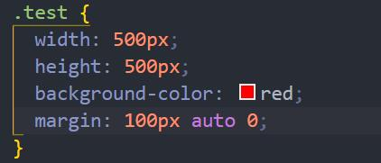
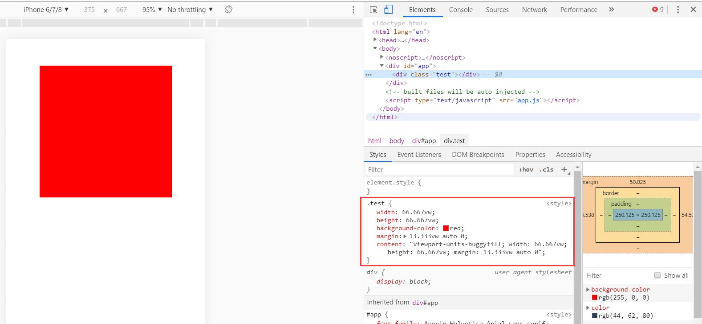

# vue-typescript-px2vw

### style中写的样式 


### 编译后在浏览器中的样式


### 全程看大漠大佬的博客配置
[博客原文地址](https://www.w3cplus.com/mobile/vw-layout-in-vue.html)

## Project setup
```
npm install
```

### Compiles and hot-reloads for development
```
npm run serve
```

### Compiles and minifies for production
```
npm run build
```
